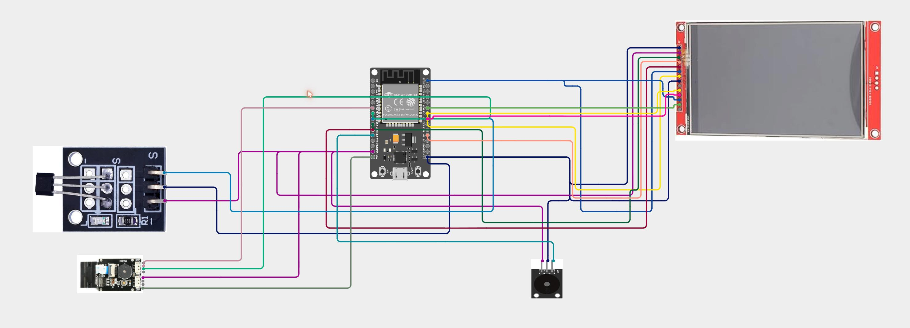
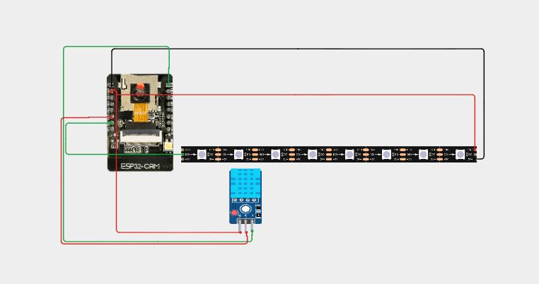
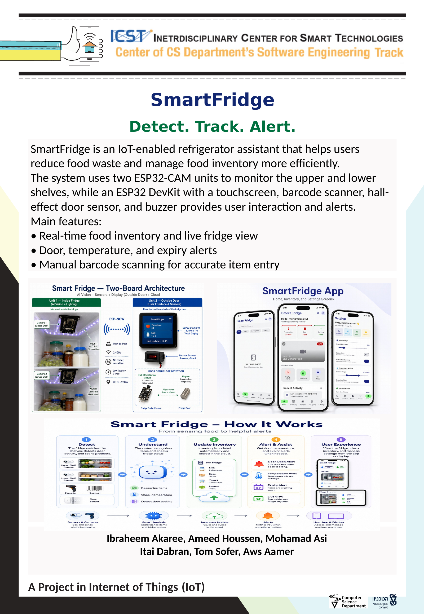

## Smart Fridge — Project by: Ibraheem Akaree, Ameed Houssen, Mohamad Asi

**Detect. Track. Alert.**

Smart Fridge is an IoT-enabled refrigerator assistant that helps users reduce food waste and manage food inventory more efficiently. Whenever the door closes, two ESP32-CAM boards photograph the upper and lower shelves, a vision AI (Google Gemini) identifies the products, and the resulting inventory is stored in Firebase. A touchscreen ESP32 mounted on the fridge door and a companion Flutter mobile app show the live inventory, per-item expiry dates, temperature and humidity, and alerts.

## Our project in detail

The system is split across two ESP32 boards that talk to each other over ESP-NOW, a Firebase backend (Firestore + Realtime Database), and a Flutter phone app:

* **Automatic inventory detection** — on door-close, each ESP32-CAM captures a photo of its shelf ("roof") and Google Gemini identifies the items; results from all shelves are merged into a single live inventory.
* **Live display** — an ILI9488 touchscreen shows the current inventory, quantities and per-unit expiry dates, refreshing instantly through a Realtime Database stream (no polling).
* **Mobile app (Flutter)** — view and edit inventory, manage settings and users, and receive push notifications.
* **Expiry tracking & alerts** — warns about expired and soon-to-expire units.
* **Barcode scanning (GM65)** — manually add a product by barcode, looked up via Open Food Facts.
* **Recipe suggestions** — Gemini suggests recipes from the current inventory (OpenAI GPT fallback).
* **Temperature & humidity monitoring** — DHT11 sensor with out-of-range alerts.
* **Door monitoring** — Hall-effect sensor with a "door left open" buzzer alert.
* **Live camera view** — request a live snapshot from any shelf camera.
* **Offline resilience** — photos and barcodes are buffered when WiFi drops and replayed on reconnect.

⟨Optional: add a short walkthrough of your main USER STORIES here, matching your printed User Stories sheet.⟩

## Folder description

* **ESP32** — firmware for both boards: `SmartFridge_ESP32_CH` (display/controller), `SmartFridge_ESP32_CAM` (camera + sensors), plus `SmartFridge_ESP32_GetMac` and UART test utilities.
* **flutter_app** — Dart/Flutter source for the mobile app.
* **Documentation** — wiring diagram and basic operating instructions.
* **Unit Tests** — test sketches for individual hardware components (input/output devices).
* **Parameters** — description of the configurable parameters (see also `parameters.h` inside each ESP32 sketch).
* **Assets** — 3D-printed parts, audio files, and the Fritzing connection diagram.

## Hardware used

| Component | Qty | Notes |
|---|---|---|
| ESP32 devkit (CH9102) | 1 | Controller + touchscreen display board |
| ESP32-CAM (AI-Thinker, OV2640) | 2 | One per shelf ("roof") |
| ILI9488 3.5" TFT 480×320 + XPT2046 touch | 1 | Main display |
| GM65 barcode scanner | 1 | UART |
| DHT11 temperature/humidity sensor | 1 | On roof1 |
| Hall-effect door sensor (3-pin) + magnet | 1 | Door open/close detection |
| Passive buzzer | 1 | Door-open alert |
| WS2811 addressable LED strip | 1 | Shelf lighting for the camera |
| ⟨power supply / wiring / enclosure⟩ | ⟨?⟩ | Confirm/add anything I missed |

## ESP32 SDK version used in this project

* **esp32 by Espressif** (Arduino core) — version **3.3.8**

## Arduino/ESP32 libraries used in this project

**Display / controller board (SmartFridge_ESP32_CH):**
* WiFiManager (tzapu) — version ⟨fill in⟩
* ArduinoJson (bblanchon) — version ⟨fill in⟩
* TFT_eSPI (Bodmer) — version ⟨fill in⟩
* TJpg_Decoder (Bodmer) — version ⟨fill in⟩

**Camera board (SmartFridge_ESP32_CAM):**
* WiFiManager (tzapu) — version ⟨fill in⟩
* ArduinoJson (bblanchon) — version ⟨fill in⟩
* FastLED — version ⟨fill in⟩
* esp32-camera — bundled with the ESP32 Arduino board package

*(The DHT11 is read with hand-written bit-banged timing, so no external DHT library is required.)*

## Connection diagram

**Controller / display board (ESP32 DevKit):**

**Camera board (ESP32-CAM + WS2811 LED strip + DHT11):**

Complete pin assignments are also documented at the top of `ESP32/SmartFridge_ESP32_CH/parameters.h` and `ESP32/SmartFridge_ESP32_CAM/parameters.h`.

## Algorithm — performance evaluation

The item-detection algorithm (Google Gemini vision) was evaluated as follows:

* **Experiment:** ⟨how you tested — e.g. N photos of the fridge under normal shelf lighting, with X known items⟩
* **Results:** ⟨quantitative results — e.g. detection accuracy %, false positives/negatives, average scan-to-result time⟩
* **Conditions:** ⟨lighting, number of items, camera distance, etc.⟩

## Project Poster

---

This project is part of ICST - The Interdisciplinary Center for Smart Technologies, Taub Faculty of Computer Science, Technion
https://icst.cs.technion.ac.il/
